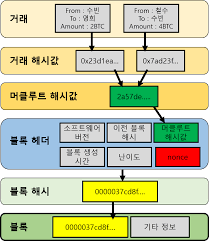

# 블록체인
## 해시함수
1. 특징
    - 단방향: 암호화는 가능한데, 수학적인 방법으로 복호화할 수 없다.
    - 가변길이 입력 -> 고정길이 출력
    - 무결성: 입력값이 다르면 출력값이 다르다. -> 입력값이 같으면 출력값도 같다.
## 머클 트리 (Merkle Tree)
머클 트리는 데이터 블록들을 효율적으로 검증하기 위해 사용되는 트리 형태의 자료구조입니다. 각 데이터 블록을 해시하여 리프 노드로 만들고, 인접한 두 리프 노드의 해시 값을 결합하여 다시 해시하는 과정을 반복하여 트리를 구성합니다. 이렇게 하면 상위 노드의 해시 값은 하위 노드의 해시 값들을 포함하게 됩니다.

## 머클 트리 루트 (Merkle Tree Root)
머클 트리 루트는 머클 트리의 최상위 노드의 해시 값입니다. 이 값은 전체 데이터 블록들의 내용을 대표하는 단일한 해시 값으로, 데이터의 무결성을 검증하는 데 사용됩니다. 머클 트리 루트가 변경되면 데이터 블록 중 하나라도 변경되었다는 것을 의미합니다.

요약하자면, 머클 트리는 데이터 검증을 위한 트리 구조이고, 머클 트리 루트는 전체 데이터를 대표하는 해시 값입니다.

## 블록체인 구조

